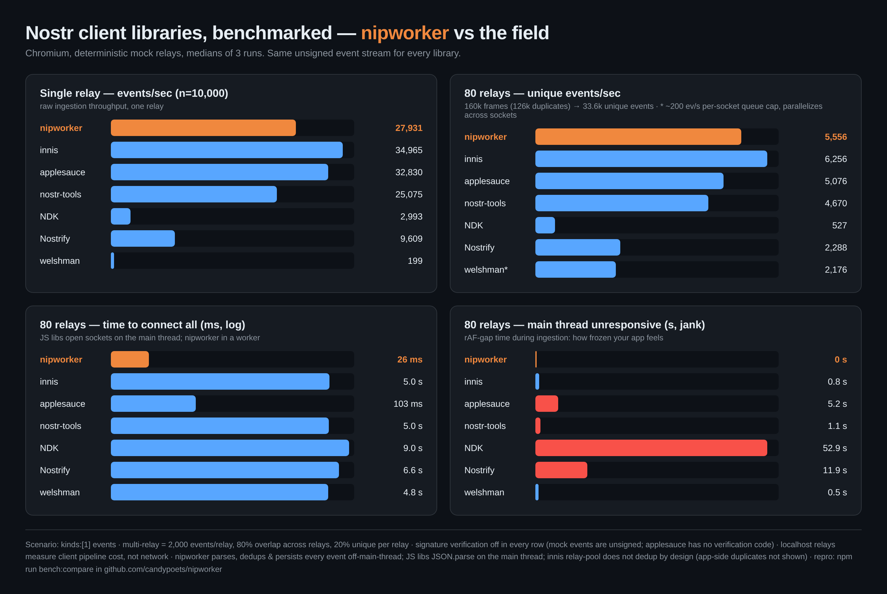

# Benchmarks

This repo's benchmark harness has two layers:

| Layer | Command | What it measures |
|---|---|---|
| Rust micro-benchmarks (criterion, native) | `npm run bench` | Hot-path internals: relay frame scanner, kind-1 parsing, NostrDB queries, batch buffer |
| Browser end-to-end (Playwright + real WASM workers) | `npm run bench:browser` | Real product: parser→main throughput, cache query latency in WASM, end-to-end event latency |

Neither runs as part of `npm test` / `npm run test:e2e` — they are measurement tools, not pass/fail gates.

## Baseline results

Environment: AMD/Linux, rustc release profile (`opt-level=3, lto=fat, codegen-units=1`), Chromium via Playwright. Absolute numbers vary by machine; use them for relative comparisons and regression checks (`cargo bench -- --baseline <name>`).

### Rust micro-benchmarks (`crates/core/benches/perf.rs`)

**frame_scan** — zero-copy scanner vs `serde_json::Value` DOM parse on the same EVENT frames:

| Frame size | `scan_relay_frame` | `serde_json` DOM | Ratio |
|---|---|---|---|
| 1 KB | 632 ns (1.51 GiB/s) | 1.29 µs | **2.0× faster** |
| 16 KB | 10.5 µs (1.45 GiB/s) | 4.77 µs | ~2.2× slower |
| 64 KB | 36.3 µs (1.68 GiB/s) | 16.4 µs | ~2.2× slower |

Nuanced finding: the scanner wins at typical small frames but serde_json's memchr-based string scanning is faster per byte on large frames. The scanner's real value is avoiding DOM allocation and reserialization downstream (the old path parsed **twice** and rebuilt the frame), not raw scan speed. The 16 KB point showed high variance (±15%).

**kind1_parse** — real `Parser::parse_kind_1` (regexes hoisted to `LazyLock` statics) vs recompiling the same 13 patterns per event:

| Path | Mean | Ratio |
|---|---|---|
| LazyLock statics (current) | 92.6 µs | — |
| `Regex::new` per event (pre-`7ce168e` behavior) | 927 µs | **~10× slower** |

Strongly validates the regex-hoisting work. Note: the current kind-1 path uses 13 hoisted patterns, so the honest comparison is 13 compilations/event — the "~23" figure in commit `7ce168e` was an overestimate.

**nostrdb_query** — 10k-event `NostrDB` (60% kind 1, 25% kind 7, 500 pubkeys, 30-day `created_at` spread):

| Query | Mean |
|---|---|
| kind-1, limit 20 | 99.1 µs |
| kind-1, limit 100 | 114 µs |
| kind-1, limit 1000 | 166 µs |
| kind-1, 1h since/until window, limit 100 | 20.2 µs |
| kind-1, single author | 1.39 µs |
| kind-1, ten authors | 13.7 µs |

Latency scales with `limit`, not candidate count — consistent with the top-k / index-driven query design (`1758ca2`, `274c188`).

**batch_buffer** — `BatchBufferManager` (16 KB threshold):

| Frame size | `add_message` | Frames per 16 KB flush |
|---|---|---|
| 500 B | 155 ns | ~32 |
| 2 KB | 255 ns | 8 |
| 8 KB | 507 ns | 2 |

### Browser end-to-end (`tests/bench/`, mock relay, no network)

**Throughput** (parser → main, kinds:[1] events):

| Events | Wall time | Events/sec | Batches | Avg batch size |
|---|---|---|---|---|
| 100 | 606 ms* | 165 | 5 | 20 |
| 1,000 | 121 ms | 8,369 | 38 | 27 |
| 10,000 | 455 ms | **22,019** | 195 | 51 |

\* n=100 includes relay connect + worker warm-up (~600 ms first event); warm runs reach first event in ~7–11 ms.

**Cache query latency in WASM** (cacheOnly, 20 repeats each):

| Limit | Mean | p50 | p95 | p99 |
|---|---|---|---|---|
| 20 | 0.96 ms | 0.7 | 1.5 | 2.2 |
| 100 | 1.32 ms | 1.3 | 1.5 | 1.8 |
| 1000 | 7.41 ms | 6.9 | 9.4 | 11.4 |

**End-to-end latency**: REQ→first event 1.8 ms; REQ→last cached event 12.6 ms; live-event one-way (relay timestamp → callback) avg 8.4 ms / p50 2 ms / p95 68 ms over a 200-event burst (~2,762 live events/sec).

## Notable findings from bring-up

- **Ring-buffer sizing is the memory bound, by design**: each subscription's ring buffer is fixed at `limit × bytesPerEvent` — this is the deliberate mechanism that keeps per-subscription memory bounded regardless of relay behavior. The bench reproduced the consequence: a 200-event live burst into a sub configured `limit: 1` dropped 189 events with "buffer full" warnings. That's intended backpressure, not a bug — but it means `limit` is a memory/burst-tolerance knob, not just a result-count knob, and one-time-query-style configs (tiny limit, live sub still open) will drop under bursts. Size for expected burst, or use `closeOnEose` for one-shot queries.
- **Batching works as designed**: average batch size grows with load (20 → 51 events/message), confirming the 16 KB threshold dominates the 50 ms timer under burst.
- **Kind-6/7 events without reference tags are dropped** by the parser pipeline (~15% of a naive synthetic mix). Expected behavior, but it skews naive throughput counts — bench filters use `kinds: [1]` for exactness.
- The PRD claim "MessageChannel throughput: 50K–200K msg/sec" is consistent with what we see: 22k events/sec were delivered in only ~195 postMessages/sec thanks to batching — two orders of magnitude of headroom.

## Follow-up optimizations (post-baseline)

**frame_scan memchr rewrite** — the inner loops of `frame_scan.rs` now skip via `memchr::memchr2/3` instead of byte-at-a-time. The scanner went from ~2.2× slower than serde_json on large frames to faster everywhere:

| Frame size | Before | After | vs serde_json |
|---|---|---|---|
| 1 KB | 632 ns | 500 ns (1.9 GiB/s) | 2.4× faster |
| 16 KB | 10.5 µs | 1.25 µs (12.2 GiB/s) | 3.8× faster |
| 64 KB | 36.3 µs | 4.29 µs (14.2 GiB/s) | 4.1× faster |

**Content-parser regex pre-checks** — all 13 regex scans in `content.rs`/`kind1.rs` are now guarded by mandatory-literal substring checks (`might_match` / `prescan_content`). Result: **~10% on markup-free notes only** (8.9µs → 8.1µs on the plain fixture), nothing on rich content. The `regex` crate already does SIMD literal prefiltering internally, so most of the anticipated win didn't exist — and a naive byte-loop pre-check actually *regressed* plain text 85% before the memchr2 rewrite. Kept because it's never slower and the guards document each pattern's required literals. A `lazylock_statics_plain` bench was added to `perf.rs` to track this.

Lesson recorded: measure before assuming — the 92.6µs `parse_kind_1` cost is mostly *matching*, not scanning-no-match, so further kind-1 wins would come from reducing per-match allocation, not more prefiltering.

**Batch timeout retune** (`BATCH_TIMEOUT_MS` 50→8, sweeper 25→4ms; `batch_buffer.rs:23`, `parser_worker.rs:30`) — the 50ms timer was the entire live-event tail latency. Measured via the browser bench (200-event live burst):

| Metric | 50/25ms | 8/4ms (kept) |
|---|---|---|
| live p95 | 58–68 ms | **11–15 ms** |
| live avg | 8.3 ms | 2.9–4.4 ms |
| live events/sec | 3,247 | ~12,000–13,700 |
| 10k throughput | 18,618 ev/s | **~23,000–24,000 ev/s** (+~29%) |

Batch count *fell* (299→102 per 10k) — the 16KB size threshold dominates bursts; the timer now only handles trickle traffic. Memory implication: same total payload bytes and the same preallocated 16KB per-sub buffers; only slightly more postMessage framing overhead at low event rates.

**wasm-opt -O3 A/B — negative result, `--no-opt` stays.** Binaryen 131 `-O3` shrank all four WASM binaries 14–19% but *regressed* every throughput row 12–22% across two runs (10k: 24,049 → ~18,900–21,000 ev/s). Binaries restored; commit `8b05cf0`'s decision to drop wasm-opt in favor of rustc-side opts is now validated by measurement instead of folklore.

**Build-config matrix** (all 4 crates rebuilt per config, ≥2 bench runs each, plus a 3-round interleaved A/B for the head-to-head; rustc 1.93 — bulk-memory/mutable-globals/sign-ext/reference-types/multivalue are already default-on):

| Config | 10k ev/s | cache p50 L=1000 | parser .wasm | Verdict |
|---|---|---|---|---|
| baseline (opt3, lto=fat) | ~23.6k | 6.6–7.4 ms | 2,912,122 | reference |
| +simd128 | ~24.9k (**+3.5% interleaved**, won 3/3 pairs) | neutral | 2,846,536 (−2.3%) | real but sub-threshold; **not adopted** |
| simd + opt-level=s | ~22.3k | neutral | 2,441,029 (−16%) | size/speed trade, not adopted |
| simd + opt-level=z | ~18k ❌ | +25–50% ❌ | 2,008,883 (−31%) | clear loser |

simd128 is consistent (won every interleaved pair, no regression anywhere) but below the 10% adoption bar, and it hard-requires Chrome 91+/FF 89+/Safari 16.4+ — older engines fail to compile the module outright. To adopt later: `crates/<x>/.cargo/config.toml` with `[target.wasm32-unknown-unknown] rustflags = ["-C", "target-feature=+simd128"]`.

**Early dedup + drop audit (post-multirelay round).** Full audit of the incoming path: **no event drops** — the parser shard dispatchers' `try_send` falls back to blocking `send` (backpressure, `parser_worker.rs:211-228`), all cross-worker channels are unbounded, and the 10k `seen_ids` cap degrades dedup rather than dropping (stops inserting, no log). The one genuinely silent drop found was `close_sub()` losing CLOSE frames on a full send queue (`transport/connection.rs:652`) — now warn-logged. Outgoing-frame drops (send-queue full, cooldown, retries exhausted) were already logged. Empirically: exact unique counts in every bench run.

Cross-relay dedup moved into the connections worker (`transport/sub_dedup.rs`: per-subId bounded ring, 4096 ids FIFO, freed on CLOSE; zero-copy id extraction ~0.5µs/frame). ~38k duplicate frames at ×25 no longer reach the parser; dups still exactly 0; parser-side dedup kept as safety net. **Throughput effect: small (~+9% at ×10, flat elsewhere)** — because the parser already deduped *before* parsing, duplicates never cost a full parse; the savings are only the channel hop + FlatBuffer wrap per dup. Conclusion: the multi-relay gap vs single-relay sits earlier in the pipe (per-frame WebSocket/gloo receipt + the connections worker's own per-frame scan/build), not in dedup. That is the next measurable target.

**Parser allocation audit** (`content.rs`, `kind1.rs`) — removed per-event deep clones of ContentBlocks (identity rebuild + double `clone()` for shorten/assign), a redundant second regex pass per match (`find_iter().collect()` + `captures()` → single `captures_iter`), unguarded 3× `str::replace` on every text block, `to_lowercase()` allocations in `process_nostr`/`process_link`/`is_hex64`, clone-heavy `group_media`, and a dead `get_link_preview()` allocation. `shorten_content` now borrows (`&[ContentBlock]`) with a no-alloc fast path when nothing needs shortening. Result: **kind1_parse 87.8µs → ~61–63µs (−29%)** on rich content, −19% on plain. Deliberately not touched (documented in code review): `ContentBlock.block_type: String` → `&'static str` and owned-text blocks (pub API break), ring-buffer owned-byte returns (storage API boundary), per-event pubkey hex keys in mute/chat_limiter pipes (key-type redesign — flagged as follow-up).

## Head-to-head: nipworker vs Innis vs Applesauce vs nostr-tools vs NDK vs Nostrify vs Welshman

`npm run bench:compare` — identical scenario for every contender: deterministic seeded mock relays on localhost, fresh page per contender, **3 full runs, medians [min–max]**, 35/35 tests green each run. Code: `tests/compare/` (own `package.json`, contenders are NOT root deps), `playwright.compare.config.ts`. Sig verification OFF everywhere (mock events are unsigned; libs that verify by default ran with it disabled — see fairness table). All numbers are client-side pipeline cost; localhost relays mean no network variance.



### Single-relay (kinds:[1], limit N)

| Contender | n=1,000 ev/s | n=10,000 ev/s | first event | long tasks | jank (10k) | heap Δ (10k) |
|---|---|---|---|---|---|---|
| **nipworker** | 7,184 [6,993–7,241] | **27,931 [26,866–28,088]** | 7.6 ms | 0 | 0 | +1.0 MB* |
| innis relay-pool | 28,902 [27,933–29,070] | **34,965 [31,908–35,162]** | 0.8 ms | 0 | 0 | ~0 |
| applesauce | 27,701 [26,042–27,855] | 32,830 [32,072–35,002] | 0.9 ms | 0 | 0 | +0.1 MB |
| nostr-tools | 20,619 [20,492–20,704] | 25,075 [23,657–26,123] | 0.9 ms | 0 | 0 | +1.0 MB |
| Nostrify | 8,410 [7,843–8,576] | 9,609 [9,240–9,853] | 1.0 ms | 0 | 0 | ~0 |
| NDK | 12,837 [12,500–12,887] | 2,993 [2,970–3,164] ⚠️ | 11.2 ms | 0 | 27 | +2.5 MB |
| Welshman | 196 | 199 | 207 ms | 0 | 0 | ~0 |

### Multi-relay (n=2,000/relay, 80% shared + 20% per-relay unique; uniques 3,600/5,600/11,600/33,600 — exact in every run)

| Contender | ×5 unique ev/s | ×10 | ×25 | ×80 | dups leaked (×80) | connect-all ×80 | jank ×80 (median) | heap Δ ×80 |
|---|---|---|---|---|---|---|---|---|
| **nipworker** | 4,781 | 5,010 | 2,369 | 5,556 | **0** | **26 ms** | **0 frames / 0 ms** | +3.7 MB* |
| innis relay-pool | **6,113** | **6,355** | 2,287 | **6,256** | **126,400** (exact) | 5,005 ms | 12 frames / 0.8 s | +3.3 MB |
| applesauce | 5,339 | 5,362 | 5,507 | 5,076 | 0 | 103 ms | 63 frames / 5.1 s | +5.2 MB |
| nostr-tools | 5,474 | 5,446 | 2,183 | 4,670 | 0 | 4,970 ms | 17 frames / 1.1 s | +3.2 MB |
| Nostrify | 2,881 | 2,675 | 2,095 | 2,288 | **~57,934** ⚠️ | 6,619 ms | ~145 frames / 11.9 s | +3.5 MB |
| welshman | 340 | 520 | 765 | 2,176 | **126,400** (exact) | 4,830 ms | 9 frames / 0.5 s | +3.3 MB |
| NDK | 3,019 | 2,251 | 923 | 527 | 0 (all suppressed) | 8,991 ms | **~635 frames / 52.9 s** | +6.6 MB |

Jank = rAF-gap time during ingestion (main-thread unresponsiveness). Note that NDK and Nostrify show **zero long tasks** (>50 ms) despite their freeze — their jank is thousands of sub-50 ms tasks, invisible to the longtask API; the rAF proxy is the honest signal. NDK's 52.9 s of jank is ~80% of its ×80 wall time.

Measured default dedup behavior: **nipworker** — full dedup in the parser worker before anything reaches main. **innis relay-pool** — **no dedup by design** ("dedup and persistence are your event store's job" — mod.js header); delivers every duplicate, exactly 1,600×(R−1). **applesauce** — `RelayPool.request()` dedups via in-RAM EventMemory, 0 leaks (its `pool.req()` is the explicitly non-deduping variant). **nostr-tools** — pool-level seen-id set, 0 leaks. **NDK** — full dedup but superlinear bookkeeping (5.7× throughput collapse ×5→×80). **Nostrify** — `CircularSet(1000)` evicts ids mid-stream, leaks duplicates past the window (counts interleaving-dependent, hence ranges). **Welshman** — no dedup at Socket level; app receives every duplicate, exactly 1,600×(R−1).

**Fairness — per-event work by default (read before quoting):** **nipworker** — full JSON→typed ParsedEvent parse, kind-specific content parsing, dedup, FlatBuffer serialization, **and persists to IndexedDB**; never verifies signatures on ingest. **innis** — JSON.parse → direct dispatch, no dedup, no persistence, no verification code. **applesauce** — JSON.parse + rxjs operators, plain objects, no persistence, **no signature verification code anywhere**. **nostr-tools** — JSON.parse + filter match (verifies by default; disabled for bench). **NDK** — JSON.parse + NDKEvent class wrapping (verifies by default; disabled). **Nostrify** — JSON.parse + always-on zod message validation (verifies by default; disabled). **Welshman** — JSON.parse only, raw Socket level.

**Reading:** on raw speed the thin JS pipelines lead — innis relay-pool is the fastest pipe in the field (35k single-relay, 6.3k unique at ×80) and does the least per event: no dedup, no persistence, no verification (its 126,400 duplicates at ×80 are the app's problem by design). nipworker is the only contender doing full parse + dedup + persistence, does it entirely off-main-thread (0 long tasks and 0 jank everywhere — innis is close at 0.8 s jank but pays a 5.0 s connect storm), and is the only one whose connect time stays flat at 80 relays (26 ms vs 4.8–9.0 *seconds* for the JS libs, whose connect storms run on the main thread). Applesauce remains the strongest deduping JS implementation — fast, correct EventMemory dedup, small footprint — and ships no signature verification at all. Nostrify and Welshman leak duplicates to the app by default at scale. One library gotcha worth knowing: innis's default non-persistent mode arms a synthetic 4 s EOSE timer per leg that silently truncates streams at scale — the bench rows use `persistent: true`; apps on the default would lose events the same way.

**Publication caveats:** ⚠️ NDK's single-relay collapse at n=10,000 is reproducible, not noise. The ×25-vs-×80 throughput inversions (several libs) come from a ~5 s connect-all floor dominating the smaller ×25 event count on this box. nostr-tools needed its default ~4.4 s connect timeout raised to survive the 80-socket browser connect storm (browser-side, not relay-side). EOSE is aggregate-only for nostr-tools/NDK/Nostrify/applesauce, per-relay for nipworker and Welshman. Connect-all cells <100 ms are noise-dominated; throughput/heap cells are all within 20% spread across runs. Welshman row = raw Socket API (its high-level APIs sit on the same throttled queue). \* `performance.memory` sees only the main thread — nipworker's worker/WASM heaps (~4 MB bytecode) are invisible to it, so its true total is higher than shown while JS libs' totals are fully shown.

**Multi-relay round 2 (connections→parser batching, raw envelope, ×80 fix).** Three steps, measured per step (medians, dups=0, uniques exact in every run):

| relays | before | batching | raw envelope | final (+buffer fix) |
|---|---|---|---|---|
| ×5 (3,600 uniques) | 4,421 | 4,605 | 5,084 | ~4,900 |
| ×10 (5,600) | 4,598 | 4,818 | 5,357 | ~5,300 |
| ×25 (11,600) | 2,488 | 2,282 | 2,596 | ~2,400 (noisy) |
| ×80 (33,600) | **158 (timeout, dead sub)** | 158 | 158 | **~5,850 (exact, all EOSE)** |

Single-relay n=10k also improved: 22k → **27,291 ev/s (+24%)**.

- **Step 1 — batched connections→parser** (BatchBufferManager 16KB/8ms, magic-prefixed batch framing, control frames bypass): flat. Not the bottleneck.
- **Step 2 — compact raw envelope**: EVENT frames skip FlatBuffer entirely — zero-copy event JSON slice straight into the parser's pipeline (`0xFEFFFFFF` magic); also killed a per-frame full-content `String` copy in `connection.rs` and a per-frame clone in the dedup path. +10-17% at ×5/×10.
- **Step 2b — the ×80 root cause was the main-thread subscription buffer**, not Rust: `ArrayBufferReader` was append-only — drained space was never reclaimed, so at ~20MB buffered the manager *closed the subscription* (froze at 28,415/33,600, 17 relays never EOSEd). Fix: after `processEvents` fully drains, `BaseBackend.tryResetSubscriptionBuffer` compare-and-resets the cursor only when the buffer still has one consumer and no new write has landed; native uses the equivalent check under the Rust subscription lock. **This also fixes live subscriptions silently dying after ~20MB in real apps** — a real product bug, distinct from the by-design `limit × bytesPerEvent` sizing.
- **Step 3 — dedup ring at ×80**: dups stayed 0; 4,096-id ring + parser's 10k `seen_ids` backstop suffice for observed interleaving skew. Memory ≈128KB/sub. Watch item if real-world skew exceeds the ring.

**Where the ceiling is now:** ×80 moves 160,080 frames in ~5.6s ≈ 28.6k frames/s end-to-end — **within ~10% of a bare Chromium page receiving the same 80-socket storm (31.6k msg/s)**. The Rust core does 58.7k msg/s single-threaded natively; the remaining cost is browser plumbing per frame (WS message event + wasm-bindgen closure + JS→WASM string copy + task wake), paid for all ~126k duplicates too. Further gains need fewer frames on the wire (relay-side windowing/negentropy, or proxy-side dedup), not more client-side per-frame work.

**Elastic subscription buffers + read-path wins.** Subscription buffers were allocated upfront at `limit × bytesPerEvent × 1.25` (38MB for limit=10k). Now: resizable ArrayBuffer starting at 256KB with `maxByteLength` = the same cap, doubling on full (`ArrayBufferReader.createBuffer`, grow-and-retry in `writePayload`); bufferFull still fires only at the cap — semantics unchanged, replay never loses bytes. In-place `resize()` keeps object identity, so cached references and read cursors stay valid with no notification (feature-detected; older engines fall back to fixed full-cap allocation). Parser-to-main frames also reuse the last decoded subscription ID after a byte comparison. Measured (n=10,000, main-thread heap Δ, forced GC):

| metric | before | after |
|---|---|---|
| heap Δ | **+97.7 MB** (peak 121.6) | **+1.0 MB** (peak ~15) |
| throughput | 22,539 ev/s | **28,151–29,706 ev/s** (+~28%) |
| multirelay heap Δ | 20–23 MB | 0.7–3.7 MB |

Throughput rose too — less GC pressure from not allocating/retaining multi-MB buffers. Unique/dup counts identical everywhere; vitest 41/41 (4 new elastic-buffer tests).

**Native/RN path.** React Native shares the subscription hook with web, but its JSI ArrayBuffer is a zero-copy view over a Rust-owned fixed-capacity buffer. Route-wake frames are now **coalesced per subId per drain batch** in the native-ffi callback bridge (`apply_event_batch`) — previously one heap allocation + FFI crossing per event for an 8-byte "sub has data" wake; a burst now costs one wake per sub. `nipworker_subscription_try_reset(handle, sub_id, expected_write_pos)` reclaims drained space only when the Rust cursor still matches and the subscription has one reader. Android and iOS expose it through JSI, and the Swift manager invokes it after fully drained reads. Elastic growth remains web-only because growing the Rust `Vec` would invalidate the native pointer.

## Reproducing & comparing

```bash
npm run bench                                    # criterion, ~4 min
cargo bench --manifest-path crates/core/Cargo.toml \
  --features parser,cache,connections -- --baseline main   # save/compare baselines
npm run bench:browser                            # playwright, ~20 s, self-starts mock relay + vite on ports 7710/5375
npm run bench:compare                            # head-to-head single-relay + multi-relay (5/10/25) vs NDK/Welshman/Nostrify/nostr-tools
```

Files: `crates/core/benches/perf.rs`, `tests/bench/{mock-relay.mjs,bench.html,bench.ts,bench.spec.ts,vite.bench.config.mjs}`, `playwright.bench.config.ts`, `tests/compare/` + `playwright.compare.config.ts` (head-to-head).

Known pre-existing issue (unrelated to this harness): `tests/e2e-browser/` specs construct workers as `new Worker(new URL('./parser/index.js', ...))` which 404s under a plain vite dev server (on-disk files are `.ts`); the bench suite works around it with a dev middleware in `tests/bench/vite.bench.config.mjs`. The e2e specs were left untouched.
