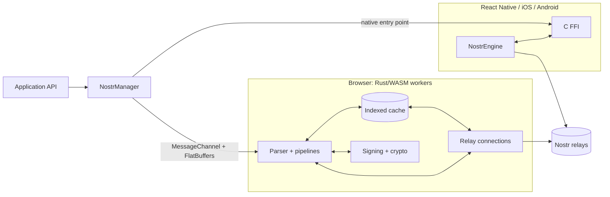
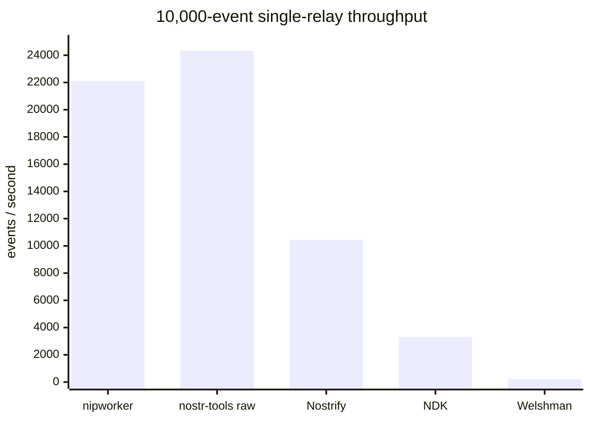

# @candypoets/nipworker

NIPWorker is a high-performance Nostr runtime for web, React Native, and native mobile apps. It
keeps relay I/O, event parsing, caching, deduplication, and signing away from the UI thread, while
exposing a small subscription and publish API.

The browser runtime uses four Rust/WASM workers. Native targets run the same Rust core through a C
FFI, without WASM. Parsed events move through the system as typed FlatBuffer views, so applications
can read only the fields they need instead of repeatedly turning JSON into object trees.

[](https://badge.fury.io/js/@candypoets%2Fnipworker)
[](https://opensource.org/licenses/MIT)

## Why NIPWorker?

- One Rust core for browser, React Native, iOS, macOS, and Android.
- Dedicated workers for connections, parsing, cache queries, and cryptography on the web.
- An indexed, persistent cache designed for feeds, pagination, and cache-first UI.
- Early cross-relay deduplication before events reach application code.
- Typed, allocation-light FlatBuffer views for parsed events and content blocks.
- Private-key, NIP-07, and NIP-46 signer integrations.
- Bounded subscription buffers, batched delivery, relay status tracking, and proxy tooling.

NIPWorker is intended for clients with real feeds, long-lived sessions, or many relays. For a script
that fetches a few raw events, `nostr-tools` may be the simpler choice.

## Choose an install path

| Application                          | Distribution                       | What to use                          |
| ------------------------------------ | ---------------------------------- | ------------------------------------ |
| Browser, Vite, or frontend framework | npm                                | `@candypoets/nipworker`              |
| React Native                         | npm + CocoaPods/Gradle autolinking | `@candypoets/nipworker/react-native` |
| Pure Swift/iOS/macOS                 | GitHub Release                     | Local `NipworkerSwift` Swift package |
| Pure Android                         | Hosted Maven repository            | Prefab AAR and C API                 |
| Node relay proxy                     | npm                                | `@candypoets/nipworker/proxy/server` |

### Web

```bash
npm install @candypoets/nipworker flatbuffers
```

The browser API is framework-agnostic. It works with React, Svelte, Vue, Solid, or vanilla
TypeScript in an environment that supports module workers and WASM.

Optional peer dependencies are `vite` for the Vite proxy plugin and `ws` for the Node relay proxy.

### React Native

Install the JavaScript package and peer dependency:

```bash
npm install @candypoets/nipworker flatbuffers
```

On iOS, install pods:

```bash
npx pod-install
```

On Android, add the NIPWorker Maven repository alongside your existing repositories in
`settings.gradle.kts`:

```kotlin
dependencyResolutionManagement {
	repositories {
		maven { url = uri("https://candypoets.github.io/nipworker/") }
	}
}
```

The React Native Gradle module selects the native artifact matching the npm package version. The
iOS XCFramework is bundled for CocoaPods autolinking. Application code must use the native entry
point:

```ts
import { createNostrManager, setManager } from '@candypoets/nipworker/react-native';

setManager(
	createNostrManager({
		defaultRelays: ['wss://relay.damus.io'],
		indexerRelays: ['wss://purplepag.es']
	})
);
```

### Pure Android

Pure Android projects do not need npm and do not need Maven Central. Add the hosted repository and
the versioned AAR to the app:

```kotlin
// settings.gradle.kts
dependencyResolutionManagement {
	repositories {
		maven { url = uri("https://candypoets.github.io/nipworker/") }
	}
}
```

```kotlin
// app/build.gradle.kts
android {
	buildFeatures {
		prefab = true
	}
}

dependencies {
	implementation("com.candypoets:nipworker-native-ffi-android:VERSION")
}
```

Replace `VERSION` with the GitHub release version without the `v` prefix.

The AAR contains `arm64-v8a`, `armeabi-v7a`, `x86`, and `x86_64` libraries plus the public
`nipworker.h` header as a Prefab module:

```cmake
find_package(nipworker-native-ffi-android REQUIRED CONFIG)

target_link_libraries(your_native_target
	nipworker-native-ffi-android::nipworker_native_ffi
)
```

This artifact is the low-level native FFI. A pure Kotlin/Java application supplies its own host
wrapper around the C/JNI API; the ready-made JavaScript host API belongs to the React Native npm
package. An offline Maven archive and standalone AAR are also attached to each release.

### Pure Swift, iOS, or macOS

Swift Package Manager is Apple's equivalent of npm or Gradle. NIPWorker currently ships a
self-contained local Swift package rather than a URL-resolvable Swift package:

1. Open the matching tag in [GitHub Releases](https://github.com/candypoets/nipworker/releases).
2. Download and unpack `nipworker-swift-sdk.zip`.
3. In Xcode, choose **File → Add Package Dependencies → Add Local** and select `NipworkerSwift`.
4. Import `NipworkerSwift` in the application target.

The archive contains Swift sources, the FlatBuffers dependency declaration, and the device,
simulator, and macOS XCFramework. A pure Swift project cannot discover this package inside
`node_modules`, and a remote `Package.swift` URL is not currently published. For lower-level C
integration, use `nipworker-native-ios.zip` and `nipworker.h` from the same release.

### Native release artifacts

Every tagged release publishes checksummed native artifacts:

| Artifact                                   | Intended consumer                    |
| ------------------------------------------ | ------------------------------------ |
| `nipworker-swift-sdk.zip`                  | Pure Swift via a local Swift package |
| `nipworker-native-ios.zip`                 | Apple C/FFI consumers                |
| `nipworker-native-android-maven.zip`       | Offline Gradle/Maven builds          |
| `nipworker-native-ffi-android-release.aar` | Direct low-level Android integration |
| `nipworker-native-ios-static.zip`          | Direct iOS static linking            |
| `nipworker-native-linux.zip`               | Local FFI testing                    |
| `nipworker-native-checksums.txt`           | SHA-256 verification                 |

## Quick start

Create one manager for the application, then subscribe with a stable ID. The `use*` functions are
framework-agnostic callback helpers; despite their names, they do not depend on React.

```ts
import { createNostrManager, setManager } from '@candypoets/nipworker';
import { usePublish, useSubscription } from '@candypoets/nipworker/hooks';
import { fbIterable, isKind1 } from '@candypoets/nipworker/utils';

const manager = createNostrManager({
	defaultRelays: ['wss://relay.damus.io', 'wss://nos.lol'],
	indexerRelays: ['wss://purplepag.es']
});

setManager(manager);

const stopFeed = useSubscription(
	'feed:home',
	[
		{
			kinds: [1],
			limit: 50,
			relays: ['wss://relay.damus.io', 'wss://nos.lol']
		}
	],
	(message) => {
		const note = isKind1(message);
		if (!note) return;

		// Read the generated FlatBuffer views directly. No unpack()/DTO copy is needed.
		for (const block of fbIterable(note, 'parsedContent')) {
			console.log(block.type(), block.text());
		}
	},
	{
		cacheFirst: true,
		closeOnEose: false,
		bytesPerEvent: 4096
	}
);

function publishNote(content: string): () => void {
	return usePublish(
		`publish:${crypto.randomUUID()}`,
		{ kind: 1, content, tags: [] },
		(status) => console.log(status),
		{ defaultRelays: ['wss://relay.damus.io', 'wss://nos.lol'] }
	);
}

// Call stopFeed() when the owning screen or component is destroyed.
```

For React Native, keep the hooks and utilities imports above, but import `createNostrManager` and
`setManager` from `@candypoets/nipworker/react-native`.

### The basic usage model

1. Create and register one manager near application startup.
2. Give each query result a stable `subId`, such as `feed:home` or `profile:<pubkey>`.
3. Subscribe with one or more Nostr filters and choose cache/network behavior.
4. Narrow each `WorkerMessage` with `isKind1`, `isKind0`, `isNostrEvent`, or another utility.
5. Read only the FlatBuffer fields the UI needs; use `fbIterable` or `fbArray` for vectors.
6. Keep the stop function and call it when the owning UI scope ends.

Treat `subId` as the identity of the result set. Reuse it for the same query so NIPWorker can share
subscription/cache state; change it when the expected result changes. Tag filters remain nested in
the request:

```ts
const requests = [
	{
		kinds: [30023],
		tags: { '#d': ['article-slug'] },
		relays: ['wss://relay.example.com']
	}
];
```

## Architecture



On the web, the UI does not own WebSockets, database scans, content parsing, or signing work. The
parser, cache, connections, and crypto workers communicate through dedicated `MessageChannel`
ports. Native builds wire the same responsibilities together in-process through `NostrEngine`, so
they skip the WASM boundary entirely.

### Optimized cache and subscriptions

The cache is part of the runtime rather than an application-side afterthought. Browser events are
persisted to IndexedDB and queried in the cache worker. Index-driven, top-k queries are designed to
scale with the requested `limit`, which is especially useful for feeds and pagination.

Useful subscription modes include:

| Option              | Behavior                                                         |
| ------------------- | ---------------------------------------------------------------- |
| `cacheFirst: true`  | Emit cached results first, then continue with relays.            |
| `cacheOnly: true`   | Query local data without opening relay requests.                 |
| `closeOnEose: true` | Close a one-shot subscription after relay EOSE.                  |
| `timeoutMs`         | Bound a subscription's active time.                              |
| `bytesPerEvent`     | Size the bounded delivery buffer for the expected event payload. |
| `pagination`        | Reuse pipeline/dedup state from an earlier subscription.         |

The delivery buffer is deliberately bounded at roughly `limit × bytesPerEvent`. For live bursty
feeds, choose a realistic limit; a tiny one-shot limit is not a suitable live-stream buffer. Use
`closeOnEose` for one-time queries and always clean up subscriptions.

NIPWorker distinguishes cache completion (`EOCE`, end of cached events) from relay completion
(`EOSE`). This lets a cache-first UI render immediately without pretending that relay collection is
finished.

### FlatBuffers and data movement

Generated FlatBuffers tables are views over the received bytes. Narrow a message, read its fields,
and keep the view intact instead of calling `.unpack()`, serializing to JSON, or building a matching
DTO by default:

```ts
import type { WorkerMessage } from '@candypoets/nipworker';
import { fbArray, isKind1 } from '@candypoets/nipworker/utils';

function onMessage(message: WorkerMessage): void {
	const note = isKind1(message);
	if (!note) return;

	const blocks = fbArray(note, 'parsedContent');
	renderBlocks(blocks);
}
```

`fbIterable()` is lazy and avoids the array allocation; `fbArray()` is convenient when array methods
are genuinely useful. If data must outlive its backing buffer or cross an application boundary,
copy only the minimal fields needed at that boundary.

JavaScript-to-JavaScript worker paths transfer `ArrayBuffer` ownership without copying. Crossing
between JavaScript and WASM still requires one copy because WASM has isolated linear memory;
FlatBuffer field access itself does not deserialize an object tree. Native builds avoid that
JS/WASM copy.

## Benchmarks

The repository measures both Rust hot paths and the complete browser product running real WASM
workers. On the recorded AMD/Linux Chromium environment, NIPWorker delivered about 22,000 fully
parsed and persisted kind-1 events per second in the 10,000-event single-relay comparison.



This is not an equal-work microbenchmark. The raw `nostr-tools` row performs JSON parsing and filter
matching. NIPWorker performs kind-specific parsing, cross-relay deduplication, FlatBuffer creation,
and IndexedDB persistence off the main thread. In the same comparison it produced zero main-thread
long tasks and zero jank frames. Absolute numbers vary by hardware; the harness is most useful for
relative comparisons and regression testing.

Other useful recorded results:

| Measurement                                 | Result                                             |
| ------------------------------------------- | -------------------------------------------------- |
| Cache-only query, limit 20                  | 0.96 ms mean                                       |
| Cache-only query, limit 1,000               | 6.9 ms p50 / 9.4 ms p95                            |
| Live event latency after batch retuning     | 11–15 ms p95                                       |
| Rich kind-1 parser after allocation work    | 61–63 µs, about 29% faster                         |
| 25-relay connection setup in the comparison | 15 ms, with no duplicate events exposed to the app |

Run the suites locally:

```bash
npm run bench           # Rust criterion hot-path benchmarks
npm run bench:browser   # Browser workers, throughput, latency, and cache
npm run bench:compare   # Head-to-head single- and multi-relay comparison
```

Methodology, environment, memory caveats, multi-relay results, and the optimization log live in
[BENCHMARKS.md](BENCHMARKS.md).

## Signers

The active manager supports several signer modes:

```ts
manager.setSigner('privkey', '<hex-secret-key>');
manager.setNip07();
manager.setNip46Bunker('<bunker-url>');
manager.setNip46QR('<nostrconnect-url>');
manager.setPubkey('<readonly-pubkey>');
```

Use `useSignEvent(template, callback)` to sign through the active signer. Keep raw private keys out
of application source and prefer platform-appropriate secure storage or an external signer.

## Public entry points

| Export                               | Purpose                                                          |
| ------------------------------------ | ---------------------------------------------------------------- |
| `@candypoets/nipworker`              | Browser manager, public types, and generated FlatBuffers exports |
| `@candypoets/nipworker/hooks`        | Subscription, publish, signing, and relay-status helpers         |
| `@candypoets/nipworker/utils`        | Narrowing, FlatBuffer iteration, content, and tag helpers        |
| `@candypoets/nipworker/react-native` | React Native native manager                                      |
| `@candypoets/nipworker/proxy`        | Browser relay proxy client                                       |
| `@candypoets/nipworker/proxy/server` | Node relay proxy server                                          |
| `@candypoets/nipworker/proxy/vite`   | Vite relay proxy plugin                                          |
| `@candypoets/nipworker/legacy`       | Compatibility alias for the browser manager                      |

## Agent-oriented development

The companion [`nipworker` agent skill](https://github.com/candypoets/skills/tree/main/nipworker)
teaches compatible coding agents the integration rules that matter in real applications: narrow
`WorkerMessage` values correctly, preserve FlatBuffer views, use stable subscription IDs, write tag
filters in the right shape, and clean up subscriptions.

Install it from the Candy Poets skills repository:

```bash
npx skills add candypoets/skills@nipworker
```

Then explicitly ask the coding agent to use the NIPWorker skill when it edits a consuming frontend.
This is particularly helpful during agent-oriented development because it prevents plausible but
expensive patterns such as unpacking every event into DTOs or adding a second store that mirrors the
subscription cache.

## Supported NIPs

The schema and parser include support for NIP-01, NIP-02, NIP-04, NIP-18, NIP-19, NIP-25, NIP-44,
NIP-46, NIP-51, NIP-57, NIP-60, NIP-61, and NIP-65, plus parsed kinds for long-form articles, media,
polls, live activities, and community/group events.

## Development

Prerequisites are Node.js 18+, Rust 1.70+, `wasm-pack`, and `flatc`. Xcode and the Android SDK/NDK
are needed only for native builds.

```bash
npm run build          # WASM crates, native artifacts, and TypeScript bundle
npm run build:crates   # Browser WASM crates only
npm run build:native   # Android AAR and Apple XCFramework
npm run build:types    # TypeScript declarations
npm test               # Unit tests
npm run test:e2e       # Browser end-to-end tests
```

When changing a schema, regenerate the Rust, TypeScript, and Java outputs. Swift generation is a
separate command:

```bash
npm run flatc
npm run flatc:swift
```

See [AGENTS.md](AGENTS.md) for architecture, code style, build order, and contribution guidance.

## License

MIT License — see [LICENSE](LICENSE).
